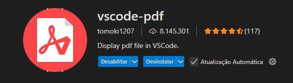

# 📚 Lista de Exercícios JavaScript - Terminal

*Este repositório contém 9 exercícios de lógica em JavaScript utilizando entrada de dados pelo terminal via* **`prompt-sync`**. *Eles abordam conceitos fundamentais como arrays, objetos, funções, condicionais e manipulação de dados.*

## ✅ Pré-requisitos

- *Node.js instalado (recomendado: v18 ou superior)*
- *Ter o pacote* **`prompt-sync`** *instalado globalmente ou localmente com o comando abaixo:*

```
npm install prompt-sync
```

### 📁 Estrutura dos Arquivos

- *Todos os exercícios estão organizados em arquivos individuais na pasta:*

```
📁 Exercicios_Mais_Pra_Ti/
    └── Lista_De_Exercicios_2/
            ├── exercicio1.js
            ├── exercicio2.js
            ├── exercicio3.js
            ├── exercicio4.js
            ├── exercicio5.js
            ├── exercicio6.js
            ├── exercicio7.js
            ├── exercicio8.js
            └── exercicio9.js
```

### 🚀 Como Executar

Navegue até o diretório onde está o arquivo e execute com o Node:

```
node Lista_De_Exercicios_2/exercicio1.js
```
- **Substitua exercicio1.js pelo nome do exercício desejado.**

### 🧠 Descrição dos Exercícios

##### Exercício  |  Descrição

`exercicio1.js`  |  *Verifica se uma data é `true` ou `false`.*

`exercicio2.js`  |  *Verifica se o usuário acertou o número gerado aleatoriamente.*

`exercicio3.js`  |  *Verifica as palavras únicas na frase digitada pelo usuário e exibe em um array.*

`exercicio4.js`  |  *Exibe o fatorial de um número digitado pelo usuário.*

`exercicio5.js`  |  *Pratica o uso do `debounce` para limitar a frequência com que uma função é executada.*

`exercicio6.js`  |  *Pratica o uso do conceito `memoize` que é uma técnica de otimização que armazena os resultados para que chamadas futuras com os mesmo argumentos sejam atendidas diretamente do cache.*

`exercicio7.js`  |  *Recebe uma lista de produtos com `nome` e `preço` do usuário e retorna um novo array apenas com os nomes, ordenados pelo preço crescente.*

`exercicio8.js`  |  *Agrupa e soma os valores por cliente em uma lista de vendas.*

`exercicio9.js`  |  *Permite converter entre pares de chave/valor e objetos usando as funções `Object.entries()` e `Object.fromEntries()`.*

### 🛠 Tecnologias Utilizadas

- **JavaScript (ES6+)**
- **Node.js**
- **prompt-sync (entrada de dados no terminal)**

### 🛠 Instalação Adicional

- Para a visualização do PDF, instale a seguinte extensão no seu VsCode:


