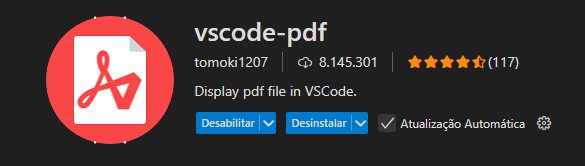

📚 Projeto HTML + CSS — Atividade Prática Completa
Este projeto reúne uma série de exercícios práticos de HTML e CSS com o objetivo de reforçar o uso de tags semânticas, listas, formulários, seletores CSS, Box Model, Grid, Flexbox e responsividade com menu hamburger.

📁 Estrutura de Arquivos
bash
Copiar
Editar
.
├── index.html          # Página principal com estrutura semântica, galeria e menu
├── listas.html         # Página com listas de hobbies e receita
├── feedback.html       # Página com formulário de feedback
├── styles.css          # Estilizações gerais e responsivas
└── image.png           # Imagem ilustrativa usada no README (extensão recomendada)
✅ Conteúdo Desenvolvido
1. Estrutura Semântica (index.html)
Uso de <header>, <main> e <footer>

Seções: Missão e Visão com <h2> e 

Rodapé com aviso de copyright

2. Listas e Navegação (listas.html)
Lista não ordenada com hobbies

Lista ordenada com passos para uma receita

Bloco de navegação com três links externos

3. Formulário de Feedback (feedback.html)
Campos: Nome, E-mail, Endereço, Tipo de Feedback e Mensagem

Botão para envio

4. Estilização com CSS (styles.css)
Cores de fundo, bordas, margens e espaçamentos aplicados com Box Model

Estilização específica para:

<h2> com font-size maior e sublinhado

Classe .destaque com font-style: italic e background-color

ID #importante com border-top espessa

5. Galeria com Grid
8 imagens com legendas organizadas em grid

Adaptável a diferentes tamanhos de tela com media queries

Centralização com Flexbox

6. Menu Hamburger
Visível apenas em telas com largura ≤ 600px

Menu padrão ocultado

Abertura/fechamento com clique no botão

📷 Demonstração Visual
Desktop	Mobile (≤ 600px)
Estrutura com menu completo	Menu hamburger ativado
Galeria em 4 colunas	Galeria adaptada por media query

🚀 Como Utilizar
Clone o repositório (ou baixe os arquivos):

bash
Copiar
Editar
git clone https://github.com/seu-usuario/seu-repositorio.git
Abra no VSCode:

bash
Copiar
Editar
cd seu-repositorio
code .
Abra o arquivo index.html com Live Server ou diretamente em seu navegador.

### 🛠 Instalação Adicional
Para uma melhor visualização de arquivos PDF ou HTML diretamente no VSCode, instale a seguinte extensão:

